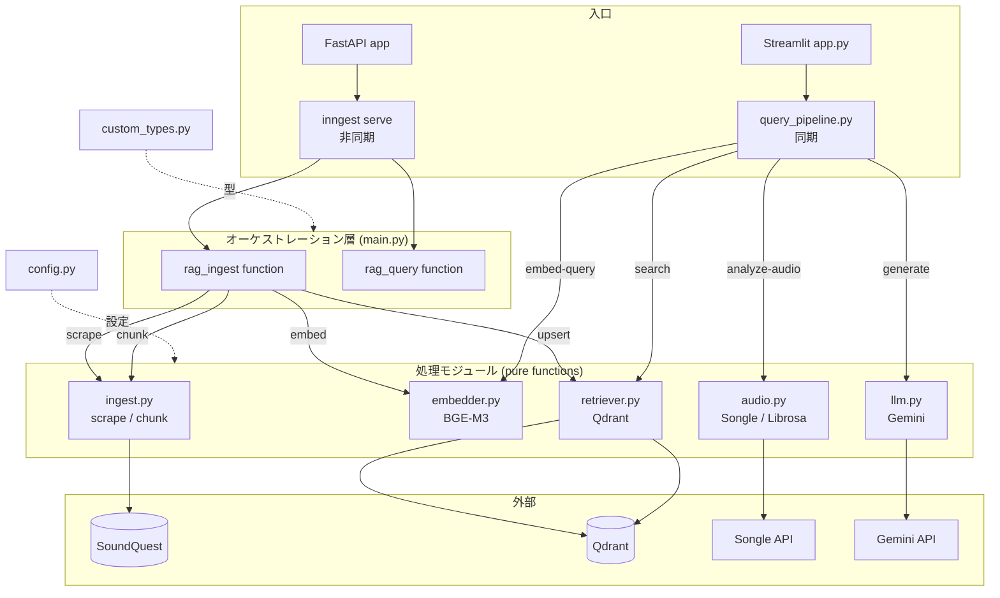

# music-rag

日本語の音楽理論教材コーパスを根拠に、コード進行・メロディ・リズムに関する質問へ日本語で解説する RAG システム。
ユーザーの質問（＋任意で楽曲の音響特徴）に対し、教材から関連箇所を検索し、それを根拠に Gemini が解説を生成する。

> 個人利用・研究用プロジェクト。教材コーパス（SoundQuest / soundquest.jp）の著作権は原著者に帰属する。
> 利用許諾を権利者へ打診中であり、許諾が確認できるまで公開デプロイは行わない。
> 上記の理由から、教材コーパス本体（`data/`）はこのリポジトリに含めていない。

---

## Demo

> 質問を入力すると、教材から関連箇所を検索し、それを根拠に日本語の解説を生成する。
> 解説の出典となった教材を併記する。

<!-- ここにデモのスクリーンショット / GIF を配置 -->
<!-- 例:  -->

---

## 何をするか

- **質問応答**: 「ドミナントモーションとは?」のような質問に、教材を根拠に日本語で解説する
- **根拠の提示**: 解説の出典となった教材チャンクと類似度スコアを返す
- **音響解析（任意）**: 楽曲URL（Songle）またはローカル音源（Librosa）から BPM・キー・コード進行などを抽出し、理論解説に結びつける

---

## 現状（MVP）

- **コーパス**: SoundQuest の一般公開記事 162 本を取り込み済み（Qdrant `music_theory` に 1,502 points）。
  会員限定の有償記事 29 本は権利配慮のため除外（`check_gated.py` で検出）。
- **検索・生成**: 質問 → embed → search → generate の E2E が動作。Streamlit UI（`app.py`）から利用可能。
- **評価基盤**: hit-rate@k / MRR を計測する評価層（`evaluation.py`）と、20 問の Q&A セットを整備済み。

---

## アーキテクチャ

取り込み（ingest）と検索・生成（query）で実行モデルを分けている。

- **ingest は Inngest の非同期ジョブ**: 162 記事の埋め込みは BGE-M3（約2GB）を伴う重い処理で、
  途中失敗からの再開や同時実行数の制御が要る。`main.py` の `rag_ingest` が
  `scrape → chunk → embed → upsert` を Inngest の `step` として実行し、`concurrency=1` で
  メモリ枯渇を防ぐ。
- **query は同期パイプライン**: UI は質問に対してその場で回答を返す同期性が要るため、
  `rag_query` と同じ流れ（embed → search →(audio)→ generate）を Inngest を介さない
  同期関数（`query_pipeline.py`）として持つ。Streamlit UI はこれを直接呼ぶ。



---

## 設計方針（レイヤリング）

- **処理モジュールは純粋に保つ**: `ingest` / `embedder` / `retriever` / `llm` / `audio` は
  Inngest も `custom_types` も import しない。入出力は素の `dict` / プリミティブ。
- **オーケストレーション（接着剤）は2つ**: Inngest 経路（`main.py`）と同期経路（`query_pipeline.py`）。
  どちらもモジュール間のインターフェース不一致を吸収する（例: `retriever` の出力
  `{"text","source","score"}` → `llm` が期待する `{"text","meta":{"source":...}}` への詰め替え）。
- **`custom_types` は step 境界専用**: Inngest の `step` が出力を JSON シリアライズする箇所の
  型検証にのみ使う。同期経路（`query_pipeline.py` / `app.py`）には step 境界が無いため使わない。
- **依存方向**: `custom_types ← main.py → ingest / retriever / llm`。`main.py` だけが両方を知る。
- **冪等性**: Qdrant の point ID は `source + chunk_index` から決定的に生成され、再投入で上書きされる。

### モジュールインターフェース契約

```text
embedder.embed_query(str)            -> list[float]            # 1024 次元
embedder.embed_documents(list[str])  -> list[list[float]]
retriever.upsert(chunks, vectors)    -> {"ingested": int, "source": str}
retriever.search(vector, top_k)      -> [{"text","source","score"}, ...]
```

---

## ディレクトリ構成

| ファイル            | 役割                                                                                                                   |
| ------------------- | ---------------------------------------------------------------------------------------------------------------------- |
| `main.py`           | オーケストレーション層。Inngest function（`rag_ingest` / `rag_query`）と FastAPI 入口。step 境界の型詰めを担う接着剤。 |
| `query_pipeline.py` | 同期版クエリパイプライン。`rag_query` と同じ流れを Inngest を介さず実行し、UI から直接呼べる。                         |
| `app.py`            | Streamlit UI（同期）。質問・回答・出典・取得チャンクを表示するデモ。                                                   |
| `custom_types.py`   | step 境界（JSON シリアライズをまたぐ箇所）の Pydantic モデル。                                                         |
| `config.py`         | 設定の一元管理（Qdrant・モデル・チャンク分割・Songle など）。                                                          |
| `ingest.py`         | SoundQuest 記事のスクレイプ（`scrape`）とチャンク分割（`chunk`）。純粋関数。                                           |
| `embedder.py`       | BGE-M3 による埋め込み生成。dense 1024 次元。純粋関数。                                                                 |
| `retriever.py`      | Qdrant への `upsert` / ベクトル `search`。純粋関数。                                                                   |
| `audio.py`          | 音響解析。Songle API（web上の楽曲URL）と Librosa（ローカル音源）の2系統。                                              |
| `llm.py`            | Gemini による解説生成。                                                                                                |
| `evaluation.py`     | 検索品質の評価（hit-rate@k / MRR）。LLM を介さず retrieval のみを計測する。                                            |
| `scrape_all.py`     | 全記事を一括スクレイプして `data/raw/{source_id}.json` に保存する単体 CLI。                                            |
| `ingest_all.py`     | 162 記事の取り込みを Inngest に fan-out するトリガ。                                                                   |
| `check_gated.py`    | 会員限定（有償）記事を検出し、コーパスから除外する。                                                                   |

---

## 技術スタック

- **API / オーケストレーション**: FastAPI + Inngest
- **ベクトルDB**: Qdrant（Docker, cosine, 1024 次元）
- **埋め込み**: BGE-M3 via FlagEmbedding（dense。将来 sparse/hybrid に拡張可能）
- **生成**: Gemini API
- **音響解析**: Songle API（主）/ Librosa（ローカル）
- **言語/環境**: Python 3.13（conda + uv）

---

## セットアップ

前提: Docker, Python 3.13, conda, uv

```bash
# 1) Python 環境
conda activate rag-music-theory
uv sync

# 2) Qdrant（Docker）を起動
docker compose up -d

# 3) .env を作成
#   GEMINI_API_KEY=...
#   QDRANT_URL=http://localhost:6333
#   （任意）SONGLE_API_TOKEN=...
```

> **教材コーパスについて**: 著作権の都合により、コーパス本体（`data/`）はリポジトリに含めていない。
> コードとアーキテクチャは閲覧可能だが、動作には別途コーパスの取り込みが必要となる。
> 動作の様子は上記 Demo を参照。

## 使い方

```bash
# 取り込み（SoundQuest にアクセスするのはこの段階のみ）
uv run python scrape_all.py            # 未取得分だけローカル保存
uv run python ingest_all.py            # chunk → embed → upsert を Inngest に fan-out

# デモ UI（質問 → 検索 → 生成）
uv run streamlit run app.py

# 検索品質の評価
uv run python evaluation.py            # hit-rate@k / MRR
```

---

## ロードマップ

- **チャンク品質の刷新**: 固定長分割 → 構造ベース分割（見出し境界・breadcrumb 文脈・リッチメタデータ）。
  評価層で before/after を hit-rate@k で比較しながら反復する。
- **hybrid / sparse 検索**: BGE-M3 のフラグ切り替えで sparse ベクトルを有効化。
- **生成品質の評価**: RAGAS による 5 指標評価（節目のみ）。
- **音声入力の拡張**: ユーザーがアップロードした音源を Librosa で解析し、解説に結びつける。
- **デプロイ**: 権利者の許諾確認後。
