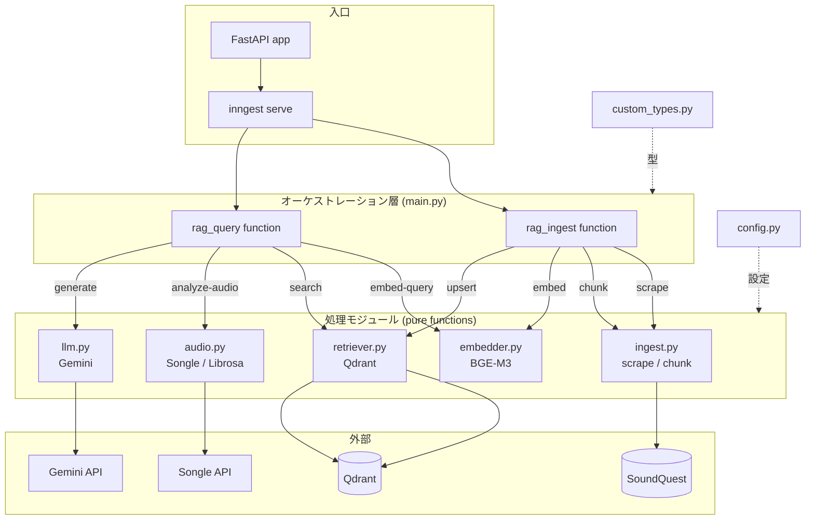

# music-rag

音楽理論教材コーパスを根拠に、楽曲のコード進行・メロディを日本語で解説する RAG システム。
ユーザーの質問（＋任意で楽曲の音響特徴）に対し、教材から関連箇所を検索し、それを根拠に Gemini が解説を生成する。

> 個人利用・研究用プロジェクト。教材コーパス（SoundQuest）の公開利用には権利者の許諾が必要であり、許諾前の公開デプロイは行わない。

---

## 何をするか

- **質問応答**: 「この進行はなぜ切なく聞こえる?」のような質問に、教材を根拠に日本語で解説する
- **音響解析（任意）**: 楽曲URL（Songle）またはローカル音源（Librosa）から BPM・キー・コード進行などを抽出し、理論解説に結びつける
- **根拠の提示**: 解説の出典となった教材チャンクを返す

---

## アーキテクチャ

オーケストレーション層（`main.py`）が各処理モジュールを Inngest の `step` として呼び出す。
処理モジュールは純粋な関数だけを持ち、Inngest や型定義に依存しない。



### データフロー

**取り込み（`rag_ingest`）**: `rag/ingest` イベントを受けて
`scrape` → `chunk` → `embed` → `upsert` を順に実行する。

**検索・生成（`rag_query`）**: `rag/query` イベントを受けて
`embed-query` → `search` →（任意で）`analyze-audio` → `generate` を実行する。

---

## ディレクトリ構成

| ファイル          | 役割                                                                                                                               |
| ----------------- | ---------------------------------------------------------------------------------------------------------------------------------- |
| `main.py`         | オーケストレーション層。Inngest function（`rag_ingest` / `rag_query`）と FastAPI 入口。step 境界の型詰めを一手に引き受ける接着剤。 |
| `custom_types.py` | step 境界（JSON シリアライズをまたぐ箇所）の Pydantic モデル。                                                                     |
| `config.py`       | 設定の一元管理（Qdrant・モデル・チャンク分割・Songle など）。                                                                      |
| `ingest.py`       | SoundQuest 記事のスクレイプ（`scrape`）とチャンク分割（`chunk`）。純粋関数。                                                       |
| `embedder.py`     | BGE-M3 による埋め込み生成。dense 1024 次元。純粋関数。                                                                             |
| `retriever.py`    | Qdrant への `upsert` / ベクトル `search`。純粋関数。                                                                               |
| `audio.py`        | 音響解析。Songle API（web上の楽曲URL）と Librosa（ローカル音源）の2系統。                                                          |
| `llm.py`          | Gemini による解説生成。                                                                                                            |
| `scrape_all.py`   | 全記事を一括スクレイプして `data/raw/{source_id}.json` に保存する単体 CLI ツール。                                                 |
| `app.py`          | Streamlit UI（旧構成の名残・MVP では非優先）。                                                                                     |

---

## 設計方針（レイヤリング）

- **処理モジュールは純粋に保つ**: `ingest` / `embedder` / `retriever` / `llm` / `audio` は
  Inngest も `custom_types` も import しない。入出力は素の `dict` / プリミティブ。
- **型詰め・オーケストレーションは `main.py` だけ**: step 境界の Pydantic 化、
  モジュール間のインターフェース不一致の吸収（例: `retriever` の出力 → `llm` が期待する形）は
  すべて接着剤である `main.py` が担う。
- **依存方向**: `custom_types ← main.py → ingest / retriever / llm`。`main.py` だけが両方を知る。
- **冪等性**: Qdrant の point ID は `source + chunk_index` から決定的に生成され、再投入で上書きされる。
  `scrape_all.py` も保存済み記事をスキップする。

### モジュールインターフェース契約

```text
embedder.embed_query(str)            -> list[float]            # 1024 次元
embedder.embed_documents(list[str])  -> list[list[float]]
retriever.upsert(chunks, vectors)    -> {"ingested": int, "source": str}
retriever.search(vector, top_k)      -> [{"text","source","score"}, ...]
```

---

## 技術スタック

- **API / オーケストレーション**: FastAPI + Inngest
- **ベクトルDB**: Qdrant（Docker, cosine, 1024 次元）
- **埋め込み**: BGE-M3 via FlagEmbedding（dense。将来 sparse/hybrid に拡張可能）
- **生成**: Gemini API
- **音響解析**: Songle API（主）/ Librosa（ローカル）
- **言語/環境**: Python 3.11（conda + uv）

---

## セットアップ

```bash
# Python 環境
conda activate rag_tim

# Qdrant（Docker）を起動しておく

# .env に設定
#   GEMINI_API_KEY=...
#   QDRANT_URL=http://localhost:6333
#   （任意）SONGLE_API_TOKEN=...
```

## 使い方

```bash
# 1) 全記事をローカルに保存（SoundQuest にアクセスするのはここだけ）
uv run python scrape_all.py            # 未取得分だけ
uv run python scrape_all.py --limit 5  # 動作確認用

# 2) FastAPI + Inngest を起動
uv run uvicorn main:app --reload
#   rag/ingest イベント → 取り込み（scrape→chunk→embed→upsert）
#   rag/query  イベント → 検索・生成（embed→search→(audio)→generate）
```

---

## ロードマップ

- **Phase 2 取り込みパイプライン**: 162 記事の `chunk → embed → upsert` を `main.py` に実装
  （fan-out か single-loop かのリトライ粒度・可観測性の設計判断あり）
- **チャンク品質の刷新**: 固定窓 → 構造ベース分割（見出し境界・breadcrumb 文脈・リッチメタデータ）
- **評価セット**: hit-rate@k 計測用の 15〜20 問
- **hybrid / sparse 検索**: BGE-M3 のフラグ切り替えで sparse ベクトルを有効化
- **可観測性**: Inngest の step 戻り値で検索結果を可視化（後に Arize Phoenix 検討）
