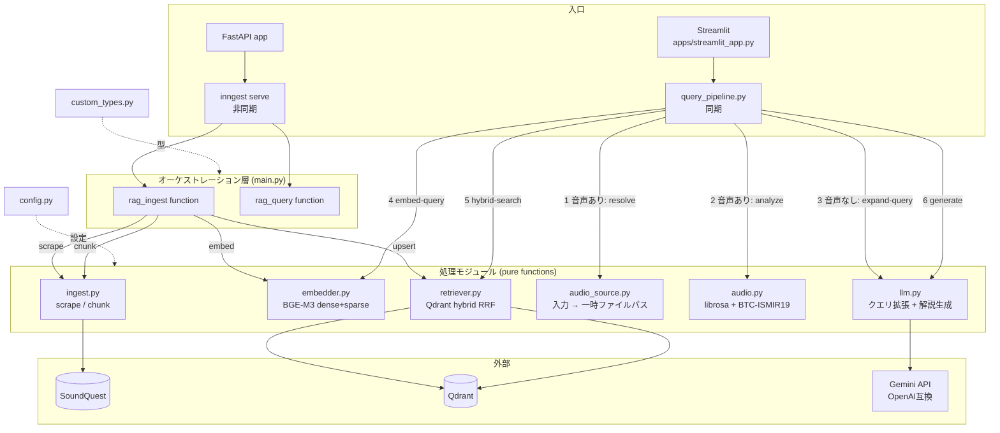

# music-rag

**[▶ デモを試す（Hugging Face Spaces）](https://huggingface.co/spaces/t3-sketch/RAG_Music_Tutor)**

日本語の音楽理論教材コーパスを根拠に、コード進行・メロディ・リズムに関する質問へ日本語で解説する RAG システムです。
ユーザーの質問（＋任意で楽曲の音響特徴）に対し、教材から関連箇所を検索し、それを根拠に LLM が解説を生成します。

> **コーパスの扱い**:
> 検索対象は SoundQuest（soundquest.jp）の記事コーパスです。著作権は原著者に帰属し、**利用許諾は打診中**。
> そのうえで、以下の線引きで運用しています。
>
> - **コーパス本体・ベクトルDBは配布しない**。`data/`（記事本文）も Qdrant のスナップショットもリポジトリ非同梱で、
>   ダウンロードできる経路はありません。デモは質問への回答を返すだけです。
> - **出典は元記事へのリンクで示す**。本文の転載はせず、読者を SoundQuest 本体へ送ります。
> - **取り込み（scrape / ingest）系のスクリプトも非公開**。公開しているのは検索・生成（query）側のコードだけです。
>
> オープンライセンス教材（Open Music Theory）版のコーパス（Qdrant `music_theory_open`）も併存しており、
> `ENABLE_HYBRID=false` で切り替えられます。コードとアーキテクチャは両系統で共通です。

---

## Demo

> 質問を入力すると、教材から関連箇所を検索し、それを根拠に日本語の解説を生成します。
> 解説の出典となった教材を併記します。


---

## 公開デモ（デプロイ構成）

公開デモは **Hugging Face Spaces（Streamlit SDK, 無料CPU）** にデプロイしています。
無料CPU枠でも約16GB RAM あり、埋め込み（BGE-M3）・音響解析（librosa + BTC）を含めた
全処理を Space 内で実行できます。GitHub の `main` への push で
[GitHub Actions](.github/workflows/hf-sync.yml) が自動で Space へ反映します。

| 層 | 公開デモでの構成 |
| --- | --- |
| 検索先 | Qdrant Cloud（`music_theory_hybrid` = SoundQuest コーパス 2,355 chunks） |
| 検索方式 | dense + sparse のハイブリッド（BGE-M3 の lexical_weights を Qdrant Prefetch → RRF 融合） |
| クエリ拡張 | Gemini `gemini-3.1-flash-lite`。度数表記の正規化・同義語を検索前に追記 |
| 埋め込み | ローカル BGE-M3（FlagEmbedding。Space 内で実行。dense/sparse を1パスで取得） |
| 生成 | Gemini `gemini-3.5-flash-lite`（OpenAI互換API。`LLM_PROVIDER` で NVIDIA / OpenRouter に切替可） |
| 音声入力 | ファイルアップロード。解析（librosa + BTC-ISMIR19）は Space 内で実行 |
| 出典表示 | 記事タイトル＋元記事へのリンクのみ。本文は表示しない（`SHOW_DEBUG_CHUNKS=false`） |

- **生成と評価 judge はプロバイダごと分離**: 生成は Gemini、RAGAS の judge は
  MiniMax（OpenRouter 経由）。self-preference bias を避けつつ、無料枠の
  レート制限（Gemini の RPD 枯渇）を評価と本番で独立させています。
- **クエリ拡張のモデルも judge とは別系統**（`QE_GEMINI_MODEL`）。judge を差し替えたときに
  本番の検索挙動が黙って変わらないようにするためです。

---

## 開発背景

「音楽理論は作曲に必要ない」と有名インフルエンサーが主張する投稿を見かけるたびに、その根拠の薄さに疑問を感じていました。実際には、著名なプロの作曲家はほぼ例外なく音楽理論を学んでいます。学んでいない人もいますが、それは長年積み重ねた音楽経験があるからこそであり、その経験則も突き詰めれば結局は「音楽理論的なもの」へと収斂していきます。

そして実際に学んでみると、今まで何気なく聴いていた楽曲の聴こえ方が変わり、コード進行の仕掛けに気づいて何倍も面白く感じられ、新たな発見が連続する世界が広がります。一方で私自身も「どこから学べばいいかわからない」という壁に直面しました。学習で最も頼りにしたのが SoundQuest という日本語の音楽理論サイトです。体系的で質が高い反面、記事数が膨大で、「今知りたいこの概念」にすぐ辿り着くのが難しい状況でした。

認知科学的にも、自ら問いを立てて答えを生成しようとするときの負荷（生成効果）こそが、効率の良い学びにつながるとされています。質問を投げれば該当箇所を根拠付きで返してくれる形にすれば、音楽理論はもっと面白く、もっと身近になる。そう考えてこのプロジェクトを始めました。音楽理論の「難しそう」という第一印象を取り払い、その本当の面白さを誰もが自分のペースで発見できるようにするための RAG システムです。

---

## 何をするか

- **質問応答**: 「ドミナントモーションとは?」のような質問に、教材を根拠に日本語で解説します
- **根拠の提示**: 解説の出典となった教材チャンクと類似度スコアを返します
- **音響解析**: アップロードされた音源から BPM・キー・コード進行を抽出し（librosa + BTC-ISMIR19）、理論解説に結びつけます

---

## NotebookLM との違い

同じ「自分の資料を根拠に答えるツール」として NotebookLM がありますが、
このシステムは **音声からの解析** と **検索方式の計測可能性** で線を引いています。

| | NotebookLM | このシステム |
| --- | --- | --- |
| テキスト教材の検索・要約 | ✅ | ✅ |
| 出典の提示 | ✅ | ✅ |
| **音声ファイルの解析** | ❌ | ✅ librosa + BTC-ISMIR19 |
| **BPM・キー・コード進行の自動検出** | ❌ | ✅ |
| 検出結果を教材で裏付けて解説 | ❌ | ✅ 解析結果は検索クエリにも反映（`audio.search_terms()`） |
| 検索方式の制御・計測 | ❌ ブラックボックス | ✅ dense / sparse / QE を要因計画で分離計測 |
| テキスト質問の回答品質（answer&#95;correctness, n=66） | **0.595** | 0.473 |

**テキスト質問の品質では NotebookLM に負けています。** ただしこの差の大半は回答長の交絡で、
回答長を揃えた 18 問だけで見ると符号が反転します（後述「[検索層と生成層の比較](#検索層と生成層の比較n662026-07)」）。

差別化の軸は品質のパーセンテージではなく **機能境界** です。NotebookLM は音声を受け取れないため、
「この曲のコード進行はなぜこう聴こえるのか」という問いには構造的に答えられません。

---

## 現状（MVP）

- **コーパス**: 2 系統。
  - SoundQuest 版（公開デモの検索対象）: 一般公開記事 162 本を dense+sparse の named vectors で保持（Qdrant `music_theory_hybrid` に 2,355 points、構造ベース chunking）。会員限定記事 29 本は権利配慮のため除外。
  - オープン教材版: Open Music Theory コーパス（Qdrant `music_theory_open`）。`ENABLE_HYBRID=false` で切替。
- **検索・生成**: 質問 → クエリ拡張 → embed（dense+sparse）→ ハイブリッド検索（RRF）→ generate の E2E が動作します。音声を添えた場合はクエリ拡張の代わりに解析結果（調・主要コード）を検索クエリに追記します。Streamlit UI（`apps/streamlit_app.py`）から利用でき、公開デモは Hugging Face Spaces で稼働します。
- **音響解析**: 音源のテンポ・キー・コード進行を解析し（BTC-ISMIR19、フォールバックはテンプレートマッチング）、解析結果を根拠に加えた解説を生成します。
- **評価基盤**: recall@k / strict hit-rate / MRR / nDCG@k（LLM 不使用・常用）と RAGAS（LLM judge・節目のみ）の 2 層評価。66 問の評価セット（silver 20 + フォーラム由来 40 + 生成 6）で、chunking の A/B → 検索層・生成層の統合比較（NotebookLM を含む）まで実施済みです（下記）。

---

## 評価と改善の記録

検索層は **recall@k / strict hit-rate / MRR / nDCG@k（LLM 不使用・常時実行可能）** と
**RAGAS（LLM judge・節目のみ）** の 2 層で評価しています。
生成層と評価 judge は、self-preference bias を避けるため意図的に別プロバイダにしています
（現行: 生成 = Gemini `gemini-3.5-flash-lite`、judge = MiniMax（OpenRouter 経由））。
なお下表の A/B 実測（2026-07）は当時の生成層 `gemini-3.5-flash` で取得した記録です（[docs/evaluation.md](docs/evaluation.md)）。

### chunking 戦略の A/B 比較（n=20、2026-07）

固定長 800 字 chunking と、見出し境界で分割し breadcrumb 文脈を付与する構造ベース chunking を比較しました。

| 指標 | fixed | structure | diff |
| --- | --- | --- | --- |
| hit-rate@5 | 0.85 | 0.85 | ±0 |
| MRR | 0.792 | 0.800 | +0.008 |
| **context&#95;precision** (RAGAS) | 0.653 | **0.788** | **+0.134** |
| context_recall (RAGAS) | 0.667 | 0.717 | +0.050 |
| faithfulness / answer_relevancy / answer_correctness | — | — | 横ばい |

- **hit-rate では両者の差がゼロ**でしたが、RAGAS の context_precision で明確な差が可視化されました。「正解記事が top-k に入ったか」だけでは、取得チャンクの中身の質（ノイズ混入）は測れないためです。
- 固定長 chunking の弱点だった比較形式の質問（例:「3m はトニックかサブドミナントか」）が context_precision/recall 0.0 → 1.0 に回復しました。
- この結果を受けて**構造ベース chunking を本番採用**しています（`CHUNK_STRATEGY` で切替可能）。
- **残課題**: 度数表記の比較質問（「5-1 と 4-1 の違い」等）は構造 chunking でも 0.0 のままでした。表記ゆれと複数記事にまたがる比較は chunking では解決できず、これが次の 2×2 実験の動機になっています。

詳細な per-question 比較は [docs/evaluation.md](docs/evaluation.md) を参照してください。

### 検索層と生成層の比較（n=66、2026-07）

評価セットを 66 問へ拡張し（silver 20 + フォーラム由来 40 + 生成 6）、
**ハイブリッド検索（dense+sparse）× クエリ拡張（QE）** の効果を検索層で分離して測ったうえで、
**その改善が回答品質まで届いているか**を NotebookLM を第三の arm に加えて測りました
（[docs/retrieval-experiment-plan.md](docs/retrieval-experiment-plan.md) /
[docs/experiment-4-three-way.md](docs/experiment-4-three-way.md)）。

**役割ごとにモデルを分離**しています。同じモデルが生成・参照・採点を兼ねると self-preference bias が
構造的に混入するため、3系統を独立させました。

| 役割 | モデル |
| --- | --- |
| 生成層（music-rag / NotebookLM 共通） | Gemini `gemini-3.5-flash-lite` |
| 参照回答（golden） | Claude Sonnet 5 |
| judge | MiniMax M3（OpenRouter） |

比較する arm は **Base（dense のみ）** と **C（dense+sparse + QE、本番採用）**、
それに **NotebookLM** です。QE 単独の中間条件（B）は本番採用していないため比較表からは外し、
必要な知見は後述の注記に残します。

**検索層**（LLM 不使用・常時計測可能。NotebookLM は記事単位の retrieval 結果を公開しないため、
すべて測定不能です）:

| 指標 | Base（dense のみ） | C（dense+sparse + QE） | NotebookLM |
| --- | --- | --- | --- |
| recall@5 | 0.599 | **0.674** | n/a |
| strict_hit | 0.500 | **0.545** | n/a |
| MRR | 0.562 | **0.615** | n/a |
| nDCG@5 | 0.5345 | 0.5779 | n/a |
| AND (n=27) | 0.352 | **0.426** | n/a |
| single (n=20) | 0.850 | **1.000** | n/a |

- **統計的に有意ではありません**（C vs Base の recall 差 +0.076、95%CI [−0.010, +0.162]、p=0.099）。
  n=66 では CI が 0 をまたぎます。それでも採用したのは全指標で符号が一貫して正であり、
  silver 20 問が 1.000 に達したためで、「有意差あり」とは主張していません。
- 未解決だった「5-1 と 4-1 の違い」は、QE が `V-I` / `正格終止` / `変格終止` を補うことで
  該当記事（cadence）を引けるようになりました。**ただし検索段階での解決であり、
  RAGAS context_precision での再計測は未実施**です。
- **多ソース比較質問（AND, n=27）は改善後も 0.426** で、single の 1.000 に大きく劣ります。
  メタデータや reranking が次の打ち手です。
- **nDCG@5 では話が単純ではありません**（+0.043、p=0.28）。AND 層に限ると、
  比較表から外した QE 単独条件 B（0.416）が C（0.393）を上回り recall の順序が反転しており、
  「条件C が全面的に優れている」とは言えません。
- **QE のモデルを新しくすると悪化しました**（`gemini-3.1-flash-lite` → `3.5-flash-lite` で
  4 比較すべて符号が負）。展開文が饒舌になりコーパス語彙から離れたことが原因と見ています。
  「新しいモデル＝この用途で良い」は成り立ちませんでした（[docs/retrieval-experiment-results-qe35.md](docs/retrieval-experiment-results-qe35.md)）。

**RAGAS**（LLM judge。詳細は [docs/experiment-4-three-way.md](docs/experiment-4-three-way.md)）:

| 指標 | Base | C | NotebookLM |
| --- | --- | --- | --- |
| factual&#95;correctness precision | 0.283 | 0.287 | **0.353** |
| factual&#95;correctness recall | 0.460 | 0.494 | **0.572** |
| answer&#95;correctness | 未測定※ | 0.473 | **0.595** |
| answer&#95;relevancy | 未測定※ | 0.855 | 0.854 |
| faithfulness | 0.632 | 0.626 | n/a — `retrieved_contexts` が無く原理的に計算不能 |
| context&#95;precision | 0.859 | 0.855 | n/a — 同上 |

※ Base は比較対象が C/NotebookLM のペアのみで、かつ answer&#95;correctness は1問あたり実測48〜76秒と
judge 負荷が重いため測定対象から外しました。

- **検索層の改善は生成層に伝わりませんでした**。条件C vs Base は4指標すべて CI が0をまたぎます
  （p=0.60〜0.89）。検索では recall@5 +0.076 / nDCG +0.043 と一貫して優位だったにもかかわらずです。
- **「唯一の公平な直接対決」である factual_correctness の NBLM 優位は、大半が回答長の交絡**でした。
  回答長との相関は precision r=−0.214 / recall r=−0.387。参照回答が「1〜3文・200字以内」なので、
  長い回答が機械的に不利になります。**回答長が近い18問だけで見ると符号が反転し、条件C が勝ちます**
  （precision +0.034 / recall +0.047）。
- **`answer_relevancy` は完全に同点**（0.8548 vs 0.8541、p=0.936）。「質問に答えているか」では差がつきません。
- **`answer_correctness` だけは長さで説明できない差でした**（Δ=+0.122、95%CI[+0.076,+0.169]、
  49勝17敗、p<0.0001）。このセッション最強の統計的差で、生成層の唯一の実質的な弱点です。
- **AND / OR 質問は NotebookLM でも解けません**（三者とも single から半減）。
  複数記事にまたがる統合は検索手法の巧拙ではなく構造的な壁である、という傍証になりました。
- **`faithfulness` 0.626 に対し `context_precision` 0.855、相関は r=0.208 と弱い**。
  「良い文脈を渡したのに接地していない」が132問中25問（19%）。生成層側の未解決事項です。

実験設計・per-question の結果は [docs/retrieval-experiment-plan.md](docs/retrieval-experiment-plan.md) /
[docs/retrieval-experiment-results.md](docs/retrieval-experiment-results.md) を参照してください。

**この計測で判明した、評価手法そのものの限界**（下記「ロードマップ／今後」の動機）:

1. **judge が音楽的な導出を検算できない** — 度数からコード名への変換を含む問いは、
   採点する側にも同じ音楽的能力が要ります。
2. **回答長が機械的な交絡になる** — 参照と回答の粒度が揃っていないと、内容ではなく長さを測ってしまいます。
3. **参照回答が生成層と同系統モデル製だった** — `answer_correctness` のように response と reference の
   両方を見る指標は、同系統モデル同士の一致度を測っている可能性があります（self-preference bias の参照版）。
   なお検索評価のラベル（`expected_source`）は別の手順で引いているため、この汚染を受けていません。

---

## アーキテクチャ

> **公開範囲について**: 取り込み（ingest）パイプラインの実装コード（`ingest.py` / `main.py` /
> scrape・ingest スクリプト）は、SoundQuest コーパスの権利配慮のため**このリポジトリには含めていません**。
> 公開しているのは、構築済みの Qdrant から検索・生成する本番経路（query）と評価基盤です。
> 以下の取り込みパイプラインの説明は設計の記録であり、対応するコードは非公開である点にご留意ください。

ユーザーが直接利用する UI は Streamlit（`apps/streamlit_app.py`）です。FastAPI + Inngest は、取り込みパイプライン（`rag_ingest`）が
バックグラウンドジョブとして正しく動作するかを検証するための実験用構成として用意しています。Inngest のジョブは
HTTP 経由で公開する必要があり、Inngest の Python SDK が公式に提供する FastAPI 用アダプタ（`inngest.fast_api.serve`）を
利用する形で、`music_rag/main.py` に最小限の FastAPI アプリを立てています。

取り込み（ingest）と検索・生成（query）で実行モデルを分けています。

- **ingest は Inngest の非同期ジョブ**: 162 記事の埋め込みは BGE-M3（約2GB）を伴う重い処理で、
  途中失敗からの再開や同時実行数の制御が必要です。`main.py` の `rag_ingest` が
  `scrape → chunk → embed → upsert` を Inngest の `step` として実行し、`concurrency=1` で
  メモリ枯渇を防いでいます。
- **query は同期パイプライン**: UI は質問に対してその場で回答を返す同期性が必要なため、
  Inngest を介さない同期関数（`query_pipeline.py`）として実装しています。
  Streamlit UI はこれを直接呼び出します。流れは音声の有無で分岐します。
  - 音声なし: `クエリ拡張(QE) → embed → hybrid search → generate`
  - 音声あり: `解析 → search_terms を検索クエリに追記 → embed → hybrid search → generate`
    （QE はスキップ。解析で得た調・コード名がクエリ拡張の役割を兼ねるため）

> **2つのオーケストレータは現在ふるまいが異なります**。同期経路（`query_pipeline.py`）は
> 上記のとおり解析結果を検索クエリにも反映しますが、Inngest 経路（`main.py` の `rag_query`）は
> 検索の後に解析し、`describe()` の結果を生成層にのみ渡す旧設計のままです。
> 本番 UI が使うのは同期経路のみです。


```mermaid
flowchart TD
    subgraph entry["入口"]
        ST[Streamlit<br/>apps/streamlit_app.py] --> QP[query_pipeline.py<br/>同期]
        FA[FastAPI app] --> ING[inngest serve<br/>非同期]
    end

    subgraph orch["オーケストレーション層 (main.py)"]
        RI[rag_ingest function]
        RQ[rag_query function]
    end

    subgraph proc["処理モジュール (pure functions)"]
        ingest[ingest.py<br/>scrape / chunk]
        embedder[embedder.py<br/>BGE-M3 dense+sparse]
        retriever[retriever.py<br/>Qdrant hybrid RRF]
        asrc[audio_source.py<br/>入力 → 一時ファイルパス]
        audio[audio.py<br/>librosa + BTC-ISMIR19]
        llm[llm.py<br/>クエリ拡張 + 解説生成]
    end

    subgraph ext["外部"]
        SQ[(SoundQuest)]
        QD[(Qdrant)]
        GM[Gemini API<br/>OpenAI互換]
    end

    ING --> RI
    ING --> RQ

    RI -->|scrape| ingest --> SQ
    RI -->|chunk| ingest
    RI -->|embed| embedder
    RI -->|upsert| retriever --> QD

    QP -->|1 音声あり: resolve| asrc
    QP -->|2 音声あり: analyze| audio
    QP -->|3 音声なし: expand-query| llm
    QP -->|4 embed-query| embedder
    QP -->|5 hybrid-search| retriever --> QD
    QP -->|6 generate| llm --> GM

    config[config.py] -.設定.-> proc
    types[custom_types.py] -.型.-> orch
```

---

## 設計方針（レイヤリング）

- **処理モジュールは純粋に保つ**: `ingest` / `embedder` / `retriever` / `llm` / `audio` は
  Inngest も `custom_types` も import しません。入出力は素の `dict` / プリミティブです。
- **オーケストレーション（接着剤）は2つ**: Inngest 経路（`main.py`）と同期経路（`query_pipeline.py`）です。
  どちらもモジュール間のインターフェース不一致を吸収します（例: `retriever` の出力
  `{"text","source","score"}` → `llm` が期待する `{"text","meta":{"source":...}}` への詰め替え）。
- **`custom_types` は step 境界専用**: Inngest の `step` が出力を JSON シリアライズする箇所の
  型検証にのみ使用します。同期経路（`query_pipeline.py` / `app.py`）には step 境界がないため使いません。
- **依存方向**: `custom_types ← main.py → ingest / retriever / llm`。`main.py` だけが両方を知ります。
- **冪等性**: Qdrant の point ID は `source + chunk_index` から決定的に生成され、再投入で上書きされます。

### モジュールインターフェース契約

```text
embedder.embed_query(str)            -> list[float]            # 1024 次元（dense のみ）
embedder.embed_query_hybrid(str)     -> {"dense": list[float], "sparse": dict}
embedder.embed_documents(list[str])  -> list[list[float]]
retriever.upsert(chunks, vectors)    -> {"ingested": int, "source": str}
retriever.search(vector, top_k)      -> [{"text","source","score"}, ...]
retriever.search_hybrid(vecs, top_k) -> [{"text","source","score"}, ...]   # RRF 融合
audio.analyze(path)                  -> {"tempo","beats","key","chords"}
audio.describe(analysis)             -> str   # 生成層プロンプト用
audio.search_terms(analysis)         -> str   # 検索クエリ追記用
```

---

## ディレクトリ構成

本番運用コード（`src/music_rag/`）と、UI・運用 CLI・実験を役割別に分離しています。

```
├── src/music_rag/            # 本番パイプライン（pip パッケージ）
│   ├── main.py               #   オーケストレーション層（Inngest function + FastAPI 入口）
│   ├── query_pipeline.py     #   同期版クエリパイプライン（UI から直接呼ぶ）
│   ├── config.py             #   設定の一元管理（collection・モデル・chunking 戦略・データパス）
│   ├── custom_types.py       #   Inngest step 境界の Pydantic 型（main.py のみが使用）
│   ├── ingest.py             #   スクレイプ + チャンク分割（fixed / structure の 2 戦略）
│   ├── embedder.py           #   BGE-M3 埋め込み（dense 1024 次元）
│   ├── retriever.py          #   Qdrant upsert / search
│   ├── llm.py                #   解説生成 + クエリ拡張（Gemini / OpenAI互換API）
│   ├── audio.py              #   音響解析（テンポ・キー・コード進行）
│   ├── audio_source.py       #   音声URL入力の解決レイヤー（YouTube / ニコニコ → 一時ファイル）
│   └── model/                #   BTC-ISMIR19 vendoring（コード認識モデル）
├── apps/
│   └── streamlit_app.py      # Streamlit UI（質問・回答・出典・音響解析結果を表示）
├── scripts/                  # 運用 CLI
│   ├── scrape_all.py         #   全記事を一括スクレイプして data/raw/ に保存
│   ├── ingest_all.py         #   clean 記事の取り込みを Inngest に fan-out
│   └── check_gated.py        #   会員限定記事を検出し data/reports/ にレポート出力
├── experiments/
│   └── evaluation.py         # hit-rate@k / MRR / RAGAS、chunking 戦略の A/B 比較
├── docs/                     # デモ画像・評価結果詳細
└── data/                     # コーパス・評価データ（権利保護のため git 管理外）
```

---

## 技術スタック

- **UI**: Streamlit（公開デモは Hugging Face Spaces / Streamlit SDK）
- **取り込みパイプラインの動作検証用**: FastAPI + Inngest
- **ベクトルDB**: Qdrant（ローカルは Docker、公開デモは Qdrant Cloud。cosine, 1024 次元）
- **埋め込み**: BGE-M3（dense 1024 次元 + sparse `lexical_weights`。FlagEmbedding で自前実行。
  1 パスで両方取得し、Qdrant Prefetch → RRF で融合。2026-07 に本番投入）
- **生成**: Gemini `gemini-3.5-flash-lite`（OpenAI互換API。`LLM_PROVIDER` で NVIDIA / OpenRouter に切替可）
- **評価**: recall@k / strict hit-rate / MRR / nDCG@k（自作）+ RAGAS 0.4
  （judge は MiniMax M3 を OpenRouter 経由で使用。生成層とも参照回答とも別系統になるよう分離）
- **音響解析**: librosa（テンポ・キー）+ BTC-ISMIR19（コード認識、large_voca）
- **言語/環境**: Python 3.11（conda + uv、src layout パッケージ）

---

## セットアップ

前提: Docker, Python 3.11+, conda, uv
（URL入力機能を使う場合は ffmpeg も必要: `brew install ffmpeg`。動かなくなったらまず `uv lock --upgrade-package yt-dlp` で yt-dlp を更新）

```bash
# 1) Python 環境（music_rag パッケージが editable install される）
conda activate rag-music-theory
uv sync

# 2) Qdrant（Docker）を起動
docker compose up -d

# 3) .env を作成（雛形: .env.example）
cp .env.example .env
#   最低限:
#   GEMINI_API_KEY     … 生成層とクエリ拡張（必須。LLM_PROVIDER の既定が gemini）
#   任意:
#   NVIDIA_API_KEY                               … LLM_PROVIDER=nvidia に切り替える場合
#   OPENROUTER_API_KEY                           … RAGAS 評価を回す場合（judge 用）
#   QDRANT_CLOUD_URL / QDRANT_CLOUD_API_KEY      … Cloud へ collection を転送する場合
```

> コマンドはすべてリポジトリルートから実行してください（データパスは `./data` 基準です。
> 別の場所から実行する場合は環境変数 `MUSIC_RAG_DATA_DIR` で上書きできます）。

> **教材コーパスについて**: 著作権の都合により、コーパス本体（`data/`）はリポジトリに含めていません。
> コードとアーキテクチャは閲覧できますが、動作には別途コーパスの取り込みが必要です。
> 動作の様子は上記 Demo をご覧ください。

## 使い方

```bash
# 取り込み（SoundQuest にアクセスするのはこの段階のみ）
uv run python scripts/scrape_all.py    # 未取得分だけローカル保存
uv run python scripts/check_gated.py   # 会員限定記事を検出（data/reports/ にレポート）
uv run python scripts/ingest_all.py    # chunk → embed → upsert を Inngest に fan-out
#   ※ Inngest 経路を使う場合は別ターミナルで:
#   uv run uvicorn music_rag.main:app --reload
#   npx inngest-cli@latest dev -u http://127.0.0.1:8000/api/inngest

# デモ UI（質問 → 検索 → 生成。音声ファイルのアップロード / YouTube・ニコニコURL入力にも対応）
uv run streamlit run apps/streamlit_app.py

# 検索品質の評価
uv run python experiments/evaluation.py             # hit-rate@k / MRR（全戦略比較）
CHUNK_STRATEGY=fixed uv run streamlit run apps/streamlit_app.py   # 旧chunkingとのA/B
```

---

## ロードマップ

実施済み:

- ~~チャンク品質の刷新~~: 固定長分割 → 構造ベース分割。RAGAS で context_precision +0.134 を確認し本番採用（上記「評価と改善の記録」）
- ~~生成品質の評価~~: RAGAS 5 指標評価を chunking A/B の節目で実施
- ~~音声入力~~: アップロード音源の解析（librosa + BTC-ISMIR19）と解説生成への接続
- ~~音声URL入力~~: YouTube / ニコニコ動画URLからの解析（yt-dlp。ローカル個人利用限定の機能で、公開デプロイ時は `ENABLE_URL_INPUT=false` で無効化）
- ~~公開デプロイ~~: Hugging Face Spaces（Streamlit SDK, 無料CPU）へ公開。生成は Gemini、検索は Qdrant Cloud、埋め込み・音響解析は Space 内で実行。`main` への push で GitHub Actions が自動反映。
- ~~生成層のプロバイダ移行~~: Gemini 無料枠の RPD 枯渇を避けるため生成層を切替可能に（`LLM_PROVIDER`）。RAGAS judge は bias 回避のため別プロバイダに分離。
- ~~ハイブリッド検索 + クエリ拡張~~: 2×2 要因計画で dense/sparse × QE の効果を分離計測し、条件C を本番投入（2026-07）。度数表記の比較質問は検索段階では解決。
- ~~生成層の評価~~: RAGAS の生成指標を n=66 で計測し、NotebookLM を第三の arm に加えた三つ巴比較を実施。**検索層の改善が生成層に伝わらないこと**、および**評価手法そのものに3つのバイアスがあること**を特定（2026-07）。

今後:

- **評価セットの MCQ 化**: 上記の三つ巴比較で、自由記述 + LLM judge という評価形式そのものに
  バイアス（judge の音楽的導出能力・回答長の交絡・参照回答の系統汚染）があることが分かりました。
  音楽ドメインの QA / RAG 研究を調べたところ、
  [MusicTheoryBench](https://arxiv.org/abs/2402.16153) /
  [TrustMus](https://arxiv.org/abs/2409.01864) /
  [ArtistMus](https://arxiv.org/abs/2512.05430) /
  [ABC-Eval](https://arxiv.org/abs/2509.23350) /
  [CSyMR](https://arxiv.org/abs/2601.11556) と**例外なく4択 MCQ + 完全一致採点**で、
  自由記述を LLM-as-judge で採点している先行研究は見つかりませんでした。
  MCQ に作り替えれば上記3つのバイアスは構造的に消えます。
  knowledge（用語・事実）と reasoning（導出）に層別して測り直します。
- **度数変換の決定論的ツール化**: 度数からコード名への変換を LLM に推論させず、
  純関数 + テストで保証する形にします。[CSyMR](https://arxiv.org/abs/2601.11556) は music21 の
  決定論的オペレータへの接地で分析タスク +5〜7 ポイント、
  [MuseAgent-1](https://arxiv.org/abs/2601.11968) も同じ方向を報告しており、
  音響解析（librosa / BTC が計算し、LLM は説明だけを担う）で既に採っている構成と一致します。
- **多ソース質問への打ち手**: AND / OR 質問は NotebookLM でも解けない構造的な壁でした。
  メタデータ・reranking・サブクエリ分解のいずれかを試します。
- **LLM モデルの柔軟性**: ユーザーが好みのモデルを選択できるようにします（生成層は既に OpenAI 互換API化済みで下地はあります）。
- **メロディ解析（F0）・セグメント分割**: 音響解析の拡張です。
- **SoundQuest 版の公開**: 権利者の許諾確認後に、フル版（SoundQuest コーパス）の公開可否を判断します。

---

## Credits / Third-Party

- [src/music_rag/model/](src/music_rag/model/) 配下のコード認識機能は [BTC-ISMIR19](https://github.com/jayg996/BTC-ISMIR19)
  （Jonggwon Park, "A Bi-Directional Transformer for Musical Chord Recognition", ISMIR 2019）
  の一部をvendoringしています（MIT License, Copyright (c) 2019 Jonggwon Park）。
  ライセンス全文は [src/music_rag/model/LICENSE_BTC-ISMIR19](src/music_rag/model/LICENSE_BTC-ISMIR19) を参照してください。
