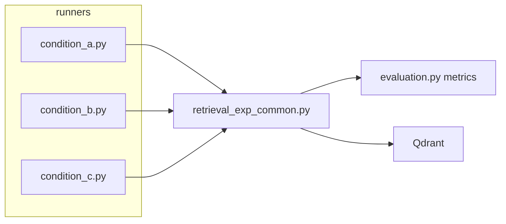

# 条件 A/B/C 評価ランナー分離

> `.cursor/plans/条件abc評価ランナー_f6afbb7e.plan.md` から保存したコピー。実装済み（2026-07-20）。

- [x] `experiments/retrieval_exp_common.py`: QE / dense+hybrid retrieve / 採点ループ / scores JSON 保存
- [x] `condition_a.py` / `condition_b.py` / `condition_c.py` を薄いエントリとして追加（仮説・主指標 docstring 付き）
- [x] 条件Bだけ limit=1 相当で import/起動パスを確認（hybrid 無しでも動くことを確認）

## 方針

[docs/retrieval-experiment-plan.md](retrieval-experiment-plan.md) §3–§4 の 2×2 のうち、実験条件側だけをランナーに分ける。

| ファイル | 条件 | sparse | QE | collection |
| --- | --- | --- | --- | --- |
| [condition_a.py](condition_a.py) | A: dense + sparse | あり | なし | `music_theory_hybrid` |
| [condition_b.py](condition_b.py) | B: dense + QE | なし | あり | `music_theory_structure`（既存 Base） |
| [condition_c.py](condition_c.py) | C: 両方 | あり | あり | `music_theory_hybrid` |

各ファイルは docstring に課題/仮説/根拠/結果（TODO）と主指標を書き、`main()` は共通関数を1回呼ぶだけにする。



## 共有モジュール

[retrieval_exp_common.py](retrieval_exp_common.py):

1. **QE** `expand_query(question) -> str`
   - モデル: `gemini-3.1-flash-lite`（計画 §7.2）
   - rewrite ではなく **expansion**（元文を残し、度数正規化・同義語を追記）
   - OpenAI互換 Gemini クライアント（既存 [src/music_rag/llm.py](../src/music_rag/llm.py) / config の `GEMINI_*` を流用）

2. **retrieve**
   - dense: 既存 `embedder.embed_query` + `retriever.search`
   - hybrid: 実験専用。BGE-M3 の sparse（lexical weights）を FlagEmbedding から取り、Qdrant Query API の **Prefetch + RRF** で融合（本番 [src/music_rag/retriever.py](../src/music_rag/retriever.py) / [src/music_rag/embedder.py](../src/music_rag/embedder.py) は変更しない）
   - QE あり: expand → retrieve。`expanded_query` を per-question に必ず保存

3. **採点**
   - [evaluation.py](evaluation.py) の `_recall_at_k` / `_strict_hit_at_k` / `_reciprocal_rank` / `load_eval_set` を再利用
   - ループは common 側（retrieve 関数を差し替え可能にする）。層別集計も evaluation と同じ形

4. **保存**
   - `data/eval/scores_condition_{a|b|c}_YYYYMMDD.json`
   - トップレベルに実験スナップショット: `condition`, `use_sparse`, `use_qe`, `collection`, `fusion`, `qe_model`, `k`, `eval_set`
   - per-question は既存 scores 互換キー（`id`, `recall`, `strict_hit`, `reciprocal_rank`, …）＋ QE 時は `expanded_query`
   - [paired_diff.py](paired_diff.py) で Base（`scores_20260719.json` の `structure`）と突き合わせられる形を維持

5. **前提チェック**
   - A/C: `music_theory_hybrid` が無ければ明確なエラーで終了（ingest は本スコープ外。別スクリプトが必要である旨をメッセージに書く）
   - B: 既存 `music_theory_structure` のみで動く

## ランナーの形（例）

```python
# experiments/condition_a.py
"""条件A: dense + sparse ...
課題/仮説/根拠/結果(TODO)
主指標: notation_variant 層の recall@5
"""
from retrieval_exp_common import run_condition

def main():
    run_condition(name="a", use_sparse=True, use_qe=False)

if __name__ == "__main__":
    main()
```

B/C も同型でフラグだけ変える。

## 明示的にやらないこと（今回）

- `music_theory_hybrid` の ingest（dense+sparse の再 upsert）— ランナーの前提。未作成なら A/C は起動時に落とす
- 本番 `query_pipeline` / Streamlit への配線
- `notation_variant` タグ付与（計画 §9-1。採点の層別はタグがあれば使う、無ければ `match_type` のみ）
- Base の再計測・RAGAS・paired_diff の実行自体

## 使い方

```bash
# repo ルートから
uv run python experiments/condition_b.py   # まず B（既存 collection だけで動く）
# hybrid ingest 後:
uv run python experiments/condition_a.py
uv run python experiments/condition_c.py
```
